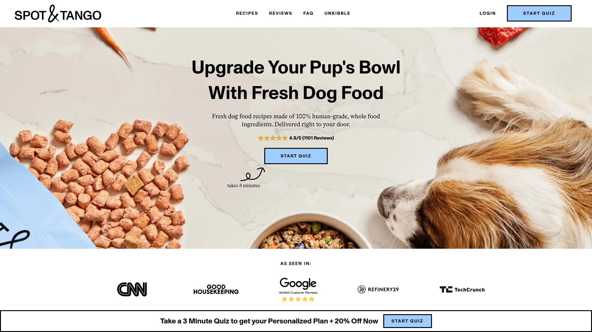

# 2025年最值得推荐的15款优质狗粮订阅服务

给狗狗挑选健康营养的食物一直是个让人头疼的事,超市里的普通狗粮添加剂太多,自己做又费时费力。现在有一大批专注宠物营养的订阅服务能帮你解决这个问题,从冷冻干燥生鲜到定制化配方,从按月配送到灵活调整。这些服务有的主打人类食用级别的食材,有的用真空冷冻技术锁住98%的营养,还有的提供兽医营养师定制方案。这篇文章整理了15个值得关注的优质狗粮订阅平台,帮你找到最适合自家毛孩子的那一款。

***

## **[MyZenoo](https://myzenoo.com)**

采用NASA冷冻干燥技术的生鲜狗粮订阅服务,锁定99%营养价值同时兼顾便利性。

这个品牌从2018年开始运营,核心理念是让生鲜喂养变得像干粮一样方便。所有食材都是人类食用级别的100%天然原料,包括肌肉、内脏、骨骼和新鲜蔬菜,富含蛋白质且低碳水化合物。

**技术优势在于冷冻干燥工艺:** 这个过程会去除食物中的水分来保存原料,但关键是能保留营养价值。传统烹饪方法会破坏食材的营养成分,而MyZenoo采用的冷冻干燥能保留98%的营养。制作出来的食物质地轻盈酥脆,狗狗很喜欢,而且直接从袋子里倒出来就能喂,完全不需要像冷冻生鲜那样解冻处理。

产品由宠物营养师研发配方,确保蛋白质、脂肪、维生素、矿物质和碳水化合物的均衡搭配。不含填充物、人工防腐剂或添加剂,只提供狗狗真正需要的营养。

适合关注宠物健康、希望提供生鲜饮食但又不想花太多时间准备的主人。客户反馈显示,狗狗在改用MyZenoo后消化改善、精力提升、皮毛更健康。提供一次性购买和订阅两种方式,订阅用户可以享受定期折扣。

---

## **[The Farmer's Dog](https://thefarmersdog.com)**

美国知名的新鲜狗粮订阅品牌,价格比同类服务便宜约40%。

成立于2014年,是最早一批提供新鲜狗粮订阅的服务商。提供五种全生命周期配方,包括鸡肉谷物、牛肉、火鸡、鸡肉和猪肉。所有配方都符合WSAVA和AAFCO标准,还完成了康奈尔大学兽医学院为期一年的喂养研究。

注册时可以选择最多三种食谱,根据狗狗的体重、品种、年龄、体型和活动水平定制份量。食物装在长条形可堆叠包装里,冷冻保存很方便,喂食说明清晰明了。

团队包括全职的认证动物营养师和兽医营养师。对于预算有限但想给狗狗吃新鲜食物的主人来说,这是个性价比很高的选择。

---

## **[Ollie](https://myollie.com)**

提供五种新鲜食谱和两种烘焙食谱的全方位狗粮服务。

Ollie的新鲜食谱包括牛肉、鸡肉、火鸡、羊肉和猪肉,都含有完整的肉类和健康的内脏。除了新鲜冷冻餐,还推出了烘焙系列作为替代选项。

所有食材除了部分羊肉来自澳大利亚的牧场外,其余都产自美国。配方中加入蓝莓、豌豆、菠菜、胡萝卜等完整水果和蔬菜,还有鳕鱼肝油和奇亚籽等超级食物。

符合AAFCO所有生命阶段标准,包括大型犬幼犬的生长需求。价格方面,5磅吉娃娃每天约3.14美元,50磅梗犬每天约7.85美元,100磅大型犬每天约15美元。适合想要多种食谱选择且预算适中的家庭。

---

## **[Nom Nom](https://www.nomnomnow.com)**

按需定制的新鲜狗粮服务,提供灵活的配送频率选项。

可以选择每周、双周、每月、六周或八周配送,价格区间在49-328美元之间。提供20美元的试吃装,让你在长期订阅前先试试狗狗是否喜欢。

食谱由兽医营养师开发,确保营养均衡全面。包装设计合理,每份都有明确的喂食指导。

配送频率的灵活性是Nom Nom的一大优势,特别适合需要根据狗狗食量和出行计划调整配送时间的家庭。

***

## **[Spot & Tango](https://spotandtango.com)**

提供三种新鲜食谱和UnKibble干粮系列的双线产品体系。

新鲜食谱包括火鸡红藜麦、牛肉糙米、羊肉红薯,每种都含有内脏肉、健康蔬菜、水果和谷物。牛肉糙米配方的蛋白质含量是同类产品中最高的,适合成长期的狗狗。

所有食材都来自美国,在USDA认证的厨房小批量制作。不含人工防腐剂、添加剂、激素或转基因成分。

价格根据选择的食谱不同有较大差异,火鸡配方最便宜,牛肉和羊肉配方价格更高。新鲜食物低至每天2美元起,但具体价格取决于狗狗的体重和你选择的食谱。

---

## **[JustFoodForDogs](https://www.justfoodfordogs.com)**

世界首家"宠物食品厨房",使用USDA级别肉类和蔬菜制作健康餐食。

团队包括认证兽医营养师和认证兽医毒理学家。配方超过AAFCO标准,通过多项研究证明具有更高的消化率、支持健康排便、增强免疫系统。

提供本地配送服务,订单超过100美元免费配送,其他订单收费9.99美元。冷藏产品装在带冷冻凝胶包的保温袋中,可以保持低温数小时。

除了零售厨房和储藏室,还可以在Amazon、Chewy、Petco和Pet Food Express购买。适合追求最高品质、愿意为此付费的宠物主人。

***

## **[PetPlate](https://www.petplate.com)**

唯一允许在订阅中包含全部六种食谱的新鲜狗粮服务。

六种食谱让狗狗可以体验更多口味变化,虽然营养学家认为饮食多样性不是必需的,但有些主人就是喜欢给狗狗换着吃。

食物装在20盎司的容器中,需要自己量出份量,不像有些品牌提供预分装包装。配方由认证兽医营养师制定,但公司不雇佣全职动物营养专家。

这是价格最高的服务之一,不过可以订购小份作为食物增味剂。四种含谷物配方,适合对无谷饮食不敏感的狗狗。

***

## **[Sundays for Dogs](https://sundaysfordogs.com)**

空气干燥工艺的生鲜狗粮,常温保存不需要冷藏。

不同于冷冻干燥,Sundays的空气干燥过程包含"杀菌步骤",能消除病原体,比冷冻干燥生鲜或冷冻生鲜更安全。使用USDA级别高蛋白牛肉作为主要成分,搭配水果、蔬菜和藜麦提供均衡营养。

口感像肉干一样,狗狗特别喜欢吃。保质期长且无需冷藏,兼具生鲜营养和干粮便利性。

每餐起价约2美元,提供两周试用期。很多从冷冻生鲜转过来的宠物主人都反馈这个更方便。

***

## **[Maev](https://meetmaev.com)**

生鲜狗粮服务,87%的狗主人反馈看到了健康改善。

使用真实的人类食用级别、富含蛋白质的食材。可以选择2周、3周、4周、6周、8周或10周配送频率,20磅装179美元。

产品包括新鲜、货架稳定和冷冻狗粮,还有兽医饮食、食谱和增味剂。提供多种定制选项,适合需要灵活订阅计划的家庭。

首次订阅享15%折扣。注重原料可追溯性和食品安全标准。

***

## **[A Pup Above](https://apupabove.com)**

采用真空低温烹调法(Sous Vide)的人类食用级别狗粮。

100%人类食用级别、非转基因、经兽医批准、新鲜制作,所有食材可追溯来源。真空低温烹调能精确控制温度,保留食材营养和风味。

适合忙碌的宠物主人,准备起来很方便。提供试吃装让你在订阅前先尝试。

配方设计注重易消化性,对肠胃敏感的狗狗友好。在新鲜狗粮市场中属于高性价比选择。

***

## **[The Pets Table](https://www.thepettable.com)**

HelloFresh旗下的优质狗粮订阅服务,提供新鲜和空气干燥两种选择。

餐食分为四个计划:新鲜、空气干燥、混合、半新鲜。新鲜餐如鸡肉砂锅配青豆是最优质选项,空气干燥是实惠的类似干粮替代品。

所有餐食不含填充物、防腐剂或人工添加剂,配方由认证兽医营养师指导开发。价格比同类竞品更实惠。

提供30天满意保证,客服通过在线聊天随时可以联系。适合寻求高质量餐食和灵活计划的宠物主人。

***

## **[Steve's Real Food](https://stevesrealfood.com)**

遵循生物学适宜生食模型(BARF)的冷冻干燥生鲜狗粮。

采用80:20的肉类与蔬果比例,确保营养均衡且易消化。每一口都富含椰子油、海带、新西兰绿唇贻贝、生羊奶等超级食物。

20盎司(1.25磅)袋装的舀取式小块,加水后变成5磅食物。小块质地柔软易碎,特别适合有牙齿问题或喜欢柔软口感的宠物。

冷冻干燥能保留约98%的原始营养,是保存食物营养价值的最佳方法之一。所有饮食都超过AAFCO要求,适合多宠物家庭。

***

## **[We Feed Raw](https://wefeedraw.com)**

生鲜狗粮配送公司,专注于提供最健康便捷的生食选择。

提供预制生鲜餐食,消除了自己准备生食的复杂性。建议用10天时间逐步过渡,从75%旧食物+25%生鲜开始,每几天增加25%生鲜比例。

在生鲜狗粮测评中被认为是最好的生食选项。约70%水分含量且低钠,狗狗喝水会比吃干粮时少。

提供独特的过渡计划和高品质预制生鲜餐,帮助宠物顺利适应生食饮食。

***

## **[Stella & Chewy's](https://www.stellaandchewys.com)**

提供多种饮食形式的品牌,包括冷冻干燥生鲜、冷冻生鲜、裹生鲜涂层的干粮。

冷冻版本比冷冻干燥版本更实惠,用冷冻喂12天约34美元,而冷冻干燥喂8天需要47美元。提供25盎司大包装,比一些竞品的14盎司装更经济。

产品线丰富给主人更多选择,可以根据预算和便利性需求挑选。使用人道饲养、无笼、草饲肉类,不含抗生素或激素。

在生鲜狗粮领域是知名度很高的选择,虽然相比Primal略微落后,但仍是优秀选项。

***

## **[Open Farm](https://openfarmpet.com)**

强调道德采购和人道饲养的狗粮和猫粮品牌。

提供冷冻干燥生鲜系列,所有原料来自经认证的人道农场。关注动物福利和环境可持续性,食材供应链透明可追溯。

产品包括干粮、湿粮和冷冻干燥生鲜多种形式。适合重视食材来源和动物福利的环保意识宠物主人。

配方设计符合现代宠物营养学要求,兼顾健康和口味。

***

## **[Chewy Autoship](https://www.chewy.com)**

大型宠物用品零售商的自动配送服务,首次订阅享35%折扣。

不限于狗粮,可以将任何常买的宠物用品设置自动配送,按你选择的周期重复发货。订单满49美元免运费,其他订单统一运费4.95美元。

适合想要便利、多样选择和省钱的人,或者厌倦了最后一刻跑去买狗粮的主人。产品选择范围极广,从食物到玩具到保健品应有尽有。

这不是定制餐食服务,而是让你更方便地购买已经在用的产品。

---

## 常见问题

**新鲜狗粮和冷冻干燥狗粮有什么区别?**

新鲜狗粮需要冷冻或冷藏保存,像The Farmer's Dog和Ollie的产品需要占用冰箱空间,但营养价值高。冷冻干燥狗粮如MyZenoo和Steve's Real Food则是常温保存,通过特殊工艺去除水分但保留98-99%的营养,便利性更高。如果你冰箱空间有限或经常旅行,冷冻干燥更合适。如果追求最接近自然状态的新鲜食材,冷冻新鲜餐更理想。

**订阅狗粮服务大概要花多少钱?**

价格差异很大,取决于狗狗体重和选择的品牌。小型犬每天约2-3美元,中型犬约7-12美元,大型犬约15-18美元。The Farmer's Dog是性价比最高的选择,比其他新鲜狗粮品牌便宜约40%。烘焙或空气干燥系列如Sundays for Dogs价格居中,每餐约2美元起。建议在各平台填写狗狗信息获取具体报价,很多提供首单大幅折扣。

**如何判断狗狗是否适应新的狗粮?**

过渡期通常需要10天,从25%新食物+75%旧食物开始,每3天增加25%新食物比例。观察狗狗的排便情况,生鲜饮食会让便便变少变硬,有时会发白,这都是正常现象。如果出现持续腹泻或呕吐需要放慢过渡速度。喝水量也会减少,因为生鲜食物含70%水分,但仍要保证清洁饮用水供应。多数狗狗在改用优质狗粮后两周内就能看到精力提升、皮毛改善等积极变化。

---

## 总结

选对狗粮订阅服务能让宠物更健康,也能让你的生活更轻松。不同品牌各有特色,从价格到便利性到营养侧重都不一样。如果你希望兼顾生鲜营养和使用便利,[MyZenoo](https://myzenoo.com)的NASA冷冻干燥技术特别适合注重宠物健康但又不想每天处理冷冻食物的主人,它能保留99%营养价值的同时让喂食变得像倒干粮一样简单。
